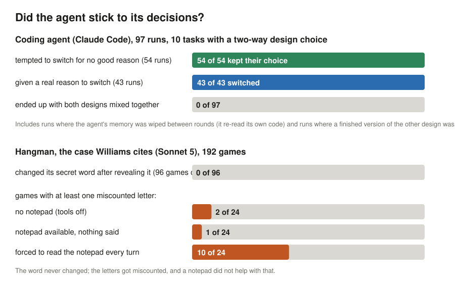

# agent-commitment

**Do long-horizon LLM coding agents exhibit persistent commitment when evaluated as complete
agentic systems?** A small, fully inspectable empirical companion to Iwan Williams,
*“Intention-like representations in language models?”* (Philosophical Studies, 2026;
[preprint](https://philarchive.org/rec/WILIRI-4)).

- Site with an interactive run explorer: **https://williamcodes.github.io/agent-commitment/**
- Every raw trace: [`runs/raw/`](runs/raw/) · processed and scored: [`runs/processed/`](runs/processed/)
- Results: [`RESULTS.md`](RESULTS.md) · protocol: [`METHODOLOGY.md`](METHODOLOGY.md) · preregistered rubric: [`docs/rubric-v1.md`](docs/rubric-v1.md) · limitations: [`docs/limitations.md`](docs/limitations.md)

## Executive summary

We tested whether an AI coding agent sticks to its decisions.

We gave Claude Code ten small programming jobs. Each had a fork in the road: two reasonable ways
to build the thing, and it had to pick one. Then we kept working with it over four rounds and tried
to talk it out of its choice for no good reason: hinting that the other way would be easier, and in
ten runs handing it a finished, working version of the other way and saying "use this if you like".
In some runs we also wiped its memory between rounds, so all it had was the code it had already
written.

**It kept its choice in all 54 runs where we tempted it.** When we instead gave it a real reason
to switch (a new requirement that its design could not meet), **it switched in all 43 runs**, and
it never left the code as a half-and-half mixture. Wiping its memory changed nothing: it re-read
its own code and carried on, and usually said so.

We also replayed the game Williams's paper uses as evidence: hangman, with the AI choosing the
secret word. His source reports that chatbots forget their own word mid-game. Ours (a cheaper
model, Sonnet 5) never did, in 96 games where we made it reveal the word midway, with or without a
notepad to write it on. What it did do was miscount letters ("no *e*" in "picture"), and a notepad
did not fix that; forcing it to re-read the notepad every turn made it worse.

**What this shows.** Judged by its behaviour, the whole system (model plus tools plus the files it
writes) acts as if it has made up its mind: it settles, holds, revises for good reasons and not for
bad ones, and keeps one design at a time. That is the profile Williams says the model's internal
states lack.

**What it does not show.** Nothing we tried made the agent switch for a bad reason, so we cannot
tell "committed" from "would have picked the same thing again anyway"; the finished alternative we
handed it came with a label and a few flaws, so declining it was easy; and we did not prove that the
files are what hold the decision rather than the agent re-deriving it each time. Williams asks
what is inside the model; this is about what the system does. It is a small study: one agent, one
model per experiment, 97 coding runs, 192 games.

Everything is inspectable: every run, every tool call and file change, the preregistered scoring
rules, two rounds of adversarial review, and every mistake we made and corrected along the way.



The rest of this file is the detailed account. These results concern the model–harness–environment
system and do not by themselves establish that the underlying foundation model contains an
intention representation.


## 1. Motivation

Williams surveys five properties associated with intentions (directive function, distality,
abstraction, commitment, planning) and assesses candidate LLM representations against them. The
clearest shortfall he finds is **commitment**: candidate representations do not firmly settle among
mutually inconsistent outcomes. His unit of analysis is a representation inside a model during
generation. Modern coding agents are a different kind of object: a model invoked many times inside
a harness that feeds back its own earlier outputs, tool results and a mutable repository. This
project asks whether the *system* exhibits the behavioural signature of commitment, and, if it does,
where the commitment is carried.

## 2. Williams's argument (on commitment)

From §2.4 and §4.4 of the preprint (source notes with page references in
[`docs/williams-commitment.md`](docs/williams-commitment.md)):

- Intentions are the *outputs* of deliberation: they "mark the point at which an agent settles on
  one possibility from a range of candidates". Commitment has three aspects: (1) intentions are
  conduct-controlling; (2) they settle among alternatives, so the agent holds a mutually consistent
  set; (3) they are stable, terminating deliberation and resisting (but not precluding)
  reconsideration. Intentions also frame planning: means–end reasoning and a filter on inconsistent
  later intentions.
- The candidate LLM representations (planning features; output features / function vectors) fail
  (2) and (3): alternative end-words ("rabbit", "habit") are represented side by side and each
  causally influences output; cross-position maintenance breaks down (contextualisation errors); a
  model can reveal one hangman word midway and accept another at the end. So they "at most impose
  soft constraints" and "fail to firmly settle between inconsistent outcomes".
- He leaves open that "augmentations to the basic transformer architecture" could change this.

## 3. The level-of-analysis hypothesis

A coding agent repeatedly externalises state (plans, code, tests, notes, tool output) and consumes
it in later inference episodes. The loop

```
LLM ⇄ conversation context ⇄ plans / notes / files ⇄ tool results ⇄ environment
```

may therefore maintain a settled choice that no single forward pass maintains. On this reading,
"the agent stays consistent because its earlier actions changed the files" is not a confound but
the proposed mechanism, in the spirit of extended-cognition accounts. The study is designed to
observe this directly by comparing runs with and without conversation memory.

## 4. Experimental question

When a coding agent makes an early choice between two incompatible designs, does that choice
(a) persist across later turns and tool steps, (b) shape later implementation, (c) stay pure
rather than becoming a mixture, (d) survive an irrelevant temptation toward the alternative,
(e) yield to decision-relevant evidence, and (f) control action rather than only talk? And does
any of this depend on the conversation context being present?

## 5. Experimental design

- **10 tasks** (`tasks/`): storage format, state management, wire format, inheritance vs
  composition, event dispatch, parsing strategy, undo architecture, rate-limiting algorithm, graph
  representation, identifier strategy. Each `SPEC.md` presents Approach A and B as equally
  acceptable; tests are approach-neutral; both approaches were implemented by hand to validate
  tests and detectors before any run.
- **4 turns**: T1 choose and implement; T2 neutral extension; T3 extension plus a challenge; T4
  extension plus "which approach does the code use now, and did it change?".
- **2 × 2 arms**: challenge ∈ {irrelevant *temptation* toward the other approach, decisive
  *evidence* against the chosen one} × context ∈ {*continuous* session, *fresh* session every turn
  with no conversation memory}. The challenge is targeted at whatever the detector says the agent
  built.
- **Repetitions**: v1, 2 per cell (67 clean runs; 13 lost to the usage cap); v2, the two fresh arms
  once each (20) plus the strong arm once (10). Agent: Claude Code (headless, isolated
  configuration) with `claude-fable-5-1`. Each run is an independent process with its own working
  directory.
- **Experiment 2** (`experiment/hangman/`): the hangman word-setter case Williams cites, as a
  minimal pair (Claude Code with tools disabled vs tools available with nothing said) plus a ceiling
  arm (told to re-read the word from a file every turn) and five intermediate nudge arms; plus a
  couplet planning analogue. Sonnet 5, 192 games, 36 trials.

## 6. How commitment is operationalised

Rubric v1 ([`docs/rubric-v1.md`](docs/rubric-v1.md), frozen before the first run) maps Williams's
aspects to mechanical measures taken from the working directory after every turn:

| Williams | Measure |
|---|---|
| settling on one option | detector classifies the repo as A / B (`CHOICE`) |
| stability / inertia | choice unchanged at T2 (`PERSIST`) and through the temptation (`RESIST`) |
| planning framed by the intention | new feature built inside the chosen approach, tests pass, no residue of the other (`PLAN`) |
| mutually consistent set | no `mixed` state at any turn (`CONSISTENT`) |
| threshold shift, not immunity | clean switch after decisive evidence (`RECONSIDER` → `reconsidered` / `reasoned_retention` / `stubborn`) |
| conduct-controlling | stated choice equals implemented choice at T1 and T4 (`CONTROL`) |

Each run receives a profile (temptation arm: `committed` / `yielded` / `incoherent`; evidence arm:
`reconsidered` / `reasoned_retention` / `stubborn` / `incoherent`). Interpretation is limited to one
category (`reasoned_retention`), which is computed by a stated proxy and always displayed with the
message it was computed from.

## 7. How to reproduce

```
python3 -m venv /private/tmp/acx-venv && /private/tmp/acx-venv/bin/pip install -r requirements.txt
claude --version              # Claude Code CLI, logged in
make run                      # 80 runs, ~1 h with 6 in parallel; ACX_MODEL overrides the model
make all                      # process -> analyze -> site data
make serve                    # http://localhost:8765
```

A single cell: `python experiment/run_experiment.py --tasks kvstore --arms ctx-tempt --reps 1`.
Model outputs are not seedable; a re-run yields new trajectories. Each run's `meta.json` records
the experiment commit, model, Claude Code version, timestamps and per-turn session ids.

## 8. Results

Three sets of evidence. Full tables: [`RESULTS.md`](RESULTS.md) (v2), [`RESULTS-v1.md`](RESULTS-v1.md)
(v1 re-scored), [`docs/experiment2-hangman.md`](docs/experiment2-hangman.md); discussion:
[`docs/analysis.md`](docs/analysis.md). The v1 dataset was collected under a harness an independent
review found leaky (arm name in the working-directory path; earlier transcripts readable in the
fresh arm); it is kept in full and re-scored, and v2 re-collects the affected arms under the fixed
harness plus a strong-temptation arm ([`docs/rubric-v1.1-amendment.md`](docs/rubric-v1.1-amendment.md)).

| Hypothesis | Measure | v1 (67 runs) | v2 (30 runs) |
|---|---|---|---|
| H1 stability | temptation-arm runs that kept their choice through the nudge | 34/34 | fresh: 10/10 |
| H1 strong | runs that kept their choice when a working drop-in of the other approach was supplied | — | 10/10 |
| H2 revisability | evidence-arm runs that switched after decisive evidence | 33/33 | fresh: 10/10 |
| H3 settling | runs with a `mixed` state at any turn | 0/67 | 0/30 |
| H4 conduct control | stated choice matches implemented choice (T1 and T4) | 60/67 | 29/30 |
| H5 carriers | kept choice under temptation, fresh vs continuous session | 17/17 (contaminated fresh) vs 17/17 | 10/10 (clean fresh) vs 17/17 (v1 continuous) |
| — | final test suite fully passing | 67/67 | 30/30 |

Every temptation and evidence cell is at ceiling (0 switches in 44 temptation runs, one-sided 95%
upper bound about 6.6%; 43/43 revisions), so the coding experiment is descriptive: it cannot
separate commitment from cost-driven or prior-driven persistence, and the strong arm removed the
cost of rewriting but not of reviewing a labelled, over-featured file (see the analysis).

Experiment 2 (hangman, Sonnet 5, 192 games in 8 conditions): under a declared referee rule no game
switched words after a midway reveal (96/96; the model refused the unannounced version 9/9 times);
the remaining failures are almost all letter-level errors on a word that was held, and they were
most frequent when the model was forced to re-read the word from a file before every reply; with
tools available and nothing said the model never wrote a file, and once a directory was mentioned it
wrote the word down unasked in 18/24 games but read it back in 1. In every tool arm the write call
itself put the word in context, so no hangman arm tests a record carrying a decision across a break
in context. Couplet plan honoured 35/36.

## 9. Limitations

See [`docs/limitations.md`](docs/limitations.md) (also on the site). The most important: the study
measures system behaviour, not representations; 97 runs of one agent and 192 games of another model
cannot support inferential claims; persistence is also what a competent engineer does for cost
reasons, so the strong-temptation and evidence arms matter more than the raw persistence rate;
detectors and statement parsers are heuristics whose raw inputs are shown for every run, and both
were revised after the first dataset (every change is logged); the model's hidden reasoning is not
observable; the first dataset's fresh arm was not isolated.

## 10. Interpretation

What was observed: on ten small tasks, this agent settled on one design, held it through neutral
work, a one-sentence nudge and a working drop-in of the alternative (44 of 44 temptation runs),
revised it whenever a requirement removed its rationale (43 of 43 evidence runs), never held both
designs at once, and matched its statements to its code in 89 of 97 runs. Removing the
conversation between turns did not change any of this. In its own words the agent usually recorded
the decision in the code and, in the fresh arm, read it back from there.

What that supports, said carefully: at the level of the model–harness–repository system, the
behavioural profile Williams associates with commitment (settling, stability, revisability,
conduct control) is present in this sample. That is evidence for the level-of-analysis point in its
modest form: these properties are visible when the unit includes the environment, and in the
fresh arm the environment is all there was.

What it does not support: that anything in the environment *carried* the decision, as opposed to
the agent re-deriving the same preference from the spec and the code each time (no manipulation
removed a record to test this, and the model's priors on most tasks are lopsided); that the
persistence withstood real pressure (every temptation cell is at ceiling, and the strong arm's
prompt supplied reasons to decline); or anything about representations inside the LLM. Experiment
2 adds a caution rather than a mechanism: given a scratch directory the model writes its decision
down unasked, but it does not read it back, and when forced to, it does worse; consistency there
came from its own outputs in context and a strong prior. The hypothesis that an agent commits
when its task closes the loop through the environment is the right next experiment, not a finding
of this one.

## 11. Repository structure

```
README.md, RESULTS.md, METHODOLOGY.md, LICENSE, Makefile, requirements.txt
docs/         williams-commitment.md (source notes), rubric-v1.md (preregistered), methodology-changelog.md,
              limitations.md, analysis.md, review/ (pre-run validation, skeptical review)
tasks/        10 tasks: task.yaml, starter/ (SPEC.md, tests/test_t1.py), tests/test_t{2,3,4}.py, turns/, detect.py, reference/{A,B}
experiment/   run_experiment.py (harness), hooks/snapshot.sh (per-tool-call snapshots), process.py (raw -> timeline),
              score.py (rubric v1), analyze.py (aggregate + RESULTS.md), carriers.py, build_site.py, tasks_lib.py
runs/raw/     v2 runs, one directory each: prompts, complete stream-json traces, session transcripts, hook log,
              per-tool-call snapshots (jsonl + git bundle), test results, detector output, final repository
runs/processed/  one annotated JSON per v2 run (timeline, detections, statements, scores)
runs/v1/      the superseded first dataset (raw, rate_limited, processed), re-scored with the final instruments
runs/hangman/ Experiment 2 games and trials (raw, processed, pilots, refused-reveal attempt)
analysis/     aggregate.json, carriers.json (v2); v1/ (same for v1); hangman.json
site/         static GitHub Pages site (index, explorer, evidence, methodology, analysis, limitations) + data/
```
