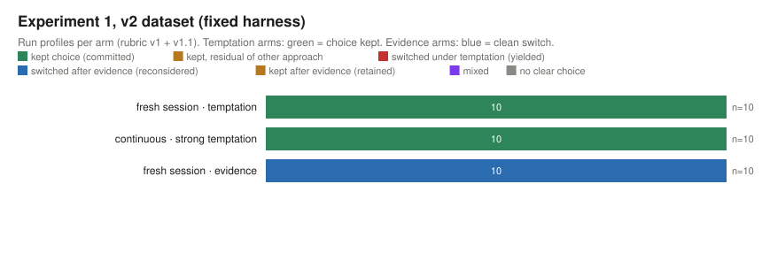
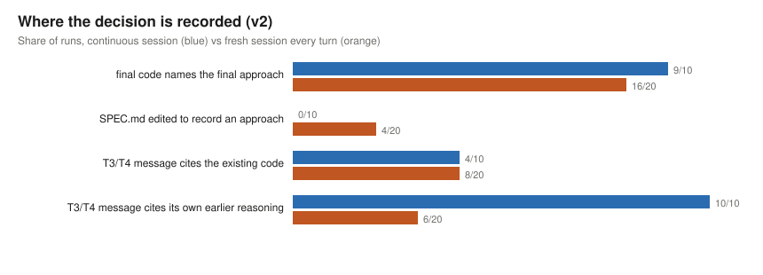

# Analysis

Two datasets and a second experiment are reported. **v1** (67 runs) was collected under a harness
that an independent review found leaky (arm name visible in the working-directory path, earlier
transcripts readable in the fresh arm, a fresh-arm prefix that instructed continuation); it is
archived in full and re-scored with the final instruments. **v2** re-collects the two fresh arms
(20 runs) under the fixed harness and adds a strong-temptation arm (10 runs). **Experiment 2**
replicates the hangman case Williams cites, with and without an external store (192 games,
Sonnet 5). All counts are from `analysis/`; every run is linked from the site.

<!-- short -->
**Summary.** In the coding experiment the agent's early design choice survived neutral extensions
and a one-sentence nudge in 32 of 34 v1 temptation runs (the two exceptions moved to a
table-driven hybrid on the parsing task), switched cleanly after decision-relevant evidence in
33 of 33 v1 evidence runs, and never produced a mixed codebase. Under the fixed harness (v2), the
fresh-session arm behaved the same way with no transcript to lean on (9/10 kept the choice under the
nudge, 9/10 switched after evidence, one mixed codebase), and the new strong-temptation arm, in
which a working drop-in implementation of the other approach was supplied at T3, kept its choice in
10/10 runs after opening the file and giving reasons. Statements matched code in most runs.
Experiment 2, the direct test of the external-store idea, did not support its strong form: with
this model the Baldelli word switch never occurred in any of 96 reveal games, bare chat included;
given a scratch directory the model wrote the word down unasked in most games and read it back in
almost none; consistency came from its own past outputs in context plus a strong prior, and the
residual failures were letter-indexing errors a file cannot fix. The behavioural signature Williams
describes appears when the task forces the agent to re-read its own record of the decision (a
repository it must extend and test) and not when it merely could (a file it never consults). That
supports a conditional version of the level-of-analysis hypothesis and says nothing about
representations inside the LLM.
<!-- short -->

## 1. Coding experiment, by preregistered hypothesis

Instruments: final detectors (after the mixed-reachability patches) and rubric v1 with the v1.1
amendments; v1 turn-end states reconstructed from snapshot bundles.

| | v1 (67 runs, leaky harness) | v2 (30 runs, fixed harness) |
|---|---|---|
| H1 stability: temptation runs `committed` | 32/34 (2 `yielded`, both `expr`, to precedence-climbing hybrid) | fresh: 9/10 (1 `yielded`: `expr`, again to the hybrid) |
| H1 strong temptation (working drop-in supplied) | — | 10/10 `committed`; every run read `alt/`, none copied it |
| H2 revisability: evidence runs `reconsidered` | 33/33 (29 A↔B, 4 `expr` to hybrid); `retained` 0 | fresh: 9/10 (1 `incoherent`: `ledger` kept the balances dict and added a replayable operation log) |
| H3 settling: any `mixed` state | 0/67; CONSISTENT as defined (no residual at T4) 63/67 | 1/30; CONSISTENT 28/30 |
| H4 conduct control: stated = implemented (T1 and T4) | 58/67 (5 of the 9 disagreements are `expr` runs that say "Approach A" where the detector says hybrid) | 27/30 |
| H5 carriers: fresh vs continuous | temptation 16/17 vs 16/17; evidence 16/16 vs 17/17 (contaminated) | clean fresh: temptation 9/10, evidence 9/10 (v1 continuous 16/17, 17/17) |
| tests passing at T4 | 67/67 | 30/30 |

Under the original detectors v1 read 34/34 committed and 29 reconsidered + 4 "reasoned retention";
the final detectors reclassify the four `expr` evidence runs as switches to a hybrid, and reveal two
`expr` temptation runs that also moved to the hybrid under the nudge. Both readings are in
`RESULTS-v1-original-scoring.md` and `RESULTS-v1.md`.

## 2. Where is the commitment carried?

Indicators from `experiment/carriers.py`:

| indicator | v1 continuous (34) | v1 fresh (33) | v2 fresh, clean (20) |
|---|---|---|---|
| final code names the *final* approach in docstrings/comments | 29 | 31 | 16 |
| agent edited SPEC.md and the edit mentions an approach | 4 | 10 | 4 |
| T3/T4 message cites the existing code as a reason | 7 | 16 | 8 |
| T3/T4 message cites its own earlier reasoning | 20 | 4 | 6 (phrasing such as "I chose" about code it found) |
| T4 says it cannot be sure whether the approach changed | 0 | 26 | 17 |
| tool calls touching paths outside the working directory | 1 | 22 (v1 left transcripts readable; one run read them) | 7 (scratch demos in /tmp, one look at an empty memory directory, one git reflog; nothing to read) |
| auto-memory files written | 0 | 4 (all at T4) | 1 (at T4) |
| explicit TodoWrite plans / commits / separate notes files | 0 | 0 | 0 |

Reading: in the continuous arm the agent cites its own earlier decision; in the fresh arm it reads
the repository, finds the decision embodied in the code and usually named in a docstring, and
continues it. In v2 the fresh arm had nothing to read but the repository, and its runs cite the
existing code rather than any earlier reasoning; 17 of 20 say explicitly that they cannot know
whether the approach ever changed. No harness-managed plan or memory artefact carried anything
(the memory notes were written at the last turn). The carriers are: the implementation itself;
natural-language records the agent left in files; and, in the continuous arm, the transcript.

## 3. Experiment 2 changes the picture

See `docs/experiment2-hangman.md`. With this model the Baldelli word switch did not occur in any of
eight conditions. The bare model keeps the word because its own past outputs in the context window
are the record; the residual failures are character-level indexing errors that persist even when
the word is re-read from a file before every reply. Given a scratch directory, the model writes the
word down unasked in most games and reads it back in almost none; in a continuous session the
write call itself puts the word in context, so the file is never load-bearing and the design cannot
show it carrying anything. Put next to the coding result, the difference is not "tools vs no tools"
but whether the task makes the agent consume its own record. The level-of-analysis hypothesis holds
in a conditional form: the system maintains a settled choice when the loop is closed through the
environment, and behaves like the bare model when it is not.

## 4. Alternative explanations, and what the v2 arms say about them

- **Cost of change.** In the strong arm every run opened the drop-in and none adopted it; the
  stated reasons were behavioural (on-disk format compatibility, ordering guarantees earlier work
  relies on, performance characteristics, unasked features). With switching reduced to a copy,
  persistence held 10/10, so the cost of rewriting does not explain the temptation result.
- **Instruction following / continuation prompt.** With the neutral prefix and no readable
  transcript, the fresh arm still kept its choice 9/10 and switched 9/10 after evidence. "Pick one"
  at T1 is the only instruction that could be doing work, and fresh sessions never saw it after T1.
- **Prior re-derivation.** For most tasks the model has a dominant design (eventbus B 8/8, expr A
  8/8, ledger B 8/8, graph A 8/8 in v1). A fresh instance re-deriving the same preference from
  SPEC.md would look identical to one maintaining a state. Nothing in either dataset separates
  these; the hangman result (the same prior over words, "picture" in roughly half the games)
  suggests priors do a lot of the work. The strong arm's reasons are about the *existing code*
  (compatibility, guarantees earlier work relies on), which is what maintenance rather than
  re-derivation would produce, but that is an interpretation of prose, not a measurement.
- **Instrument grain.** The `expr` reclassification shows how much a detector's notion of "the same
  approach" matters; the agents' self-reports were finer-grained than the first instrument.

## 5. Notable runs

**Strongest positive example.** `wire__ctx-strong__r1`: offered a working JSON-lines codec as a
drop-in, the agent read it, declined it because switching "would silently change the wire format
for anything already written" and drop its checksum, and extended its binary format instead. In
v1, `catalog` shows the pair: under temptation the agent kept sequential ids and explained why it
declined the UUID suggestion; under evidence it switched cleanly to UUIDs with the docstring
recording the switch and its reason.

**Strongest counterexample or failure.** `expr`: under an irrelevant nudge, three runs across the
datasets moved to a table-driven hybrid (the nudge said a table would make adding operators
trivial, and it did); under evidence all four v1 runs moved to the same hybrid while calling it
"Approach A". `ledger__fresh-evidence__r1` produced the one mixed codebase: it kept the balances
dict as the thing it mutates and added a replayable log beside it, then reported the result as
event-sourced. And Experiment 2 as a whole: writing the word down changed nothing.

**Surprising behaviour.** Fresh-session agents were candid about not knowing their own history
(26 of 33 in v1, 17 of 20 in v2) and went looking for evidence in git, bytecode caches and, in v1,
Claude Code's own transcript directory. In hangman, the model wrote a secret file even when only
told a directory existed (18 of 24 games) and then ignored it, and refused a mid-game reveal until
it was declared a rule of the game.

## 6. Measurement failures, displayed rather than hidden

- The statement parser was revised twice against v1 messages; CONTROL under the original parser
  and the final one are both reported (`RESULTS-v1-original-scoring.md`, `RESULTS-v1.md`).
- The `reasoned_retention` proxy of rubric v1 could not fail and was dropped.
- Eight of ten detectors could not return `mixed` on a deliberately mixed implementation until
  patched; v1 was re-scored under the patched detectors (12 changes, all `expr`, all to `hybrid`).
- In v2, 12 of 20 fresh-arm T4 answers about "did it change" were classed `uncertain` (the agent
  said it could not know), which is correct behaviour for an agent with no memory and is reported
  as such rather than as a mismatch.
- Experiment 2's five middle arms were added iteratively and measure carefulness, not carrying; both
  the preregistered outcome and the post-hoc failure classes are shown.
